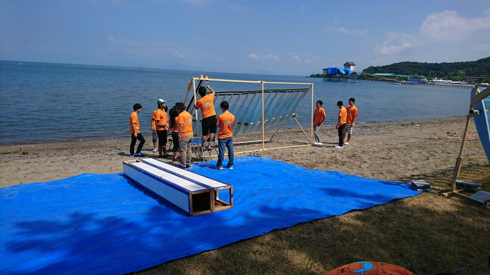
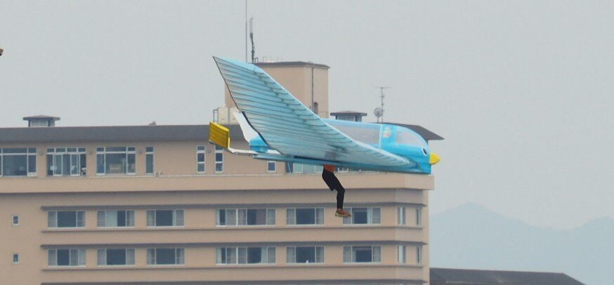

こんにちはー。初投稿になります。
翼班4年のTです。

バイトから帰ってきて、ゆっくりブログ書いてます。

さて、もう既に放送を見てご存知の方も多いでしょうが、7/28,7/29に滋賀県の彦根市で開催された鳥人間コンテストに出場してきました。

まさか自分が在学中に鳥人間コンテストに出場できるとは思いませんでした。
最初は半ば諦めていた（来年出ようかと思ってた）このプロジェクトを成功に導いてくれたOBの方々や設計・製作に関わった日立キャンのみんな、水戸キャンのみんな、そして製作において助言や材料を提供してくださったYさんとTさんには感謝してもしきれません。

第41回鳥人間コンテストの結果としては27.01mという結果を残すことが出来ました。

ほぼ0からの人力飛行機製作...
自分としては、他の鳥コン関係者から見たらお世辞にも出来のいい機体とは言えませんでしたが、自分たちの持てるソースを結集し最高の結果を残せたであろうと信じています。

書類選考を通過して鳥コン出場が決まってから駆け抜けた4か月間、たくさんの人の力を借りて活動してきました。テレビで見ていた鳥コンのプラットフォームに立つ... そんな一生の思い出に残る経験が出来たかと思います。そんな夢を未来の後輩たちに見せてあげたいので、これからは引継ぎや技術の伝達をしっかりやっていきたいと思います。

ここでは私たちが挑戦した全翼機に関する技術的なお話は割愛させていただきます（また今度）

ここまで読んでいただきありがとうございました。
