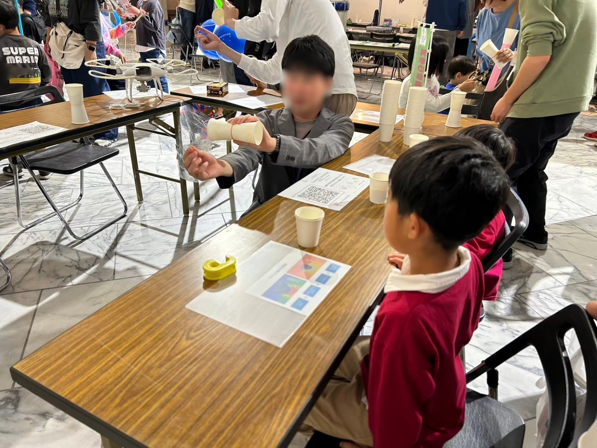
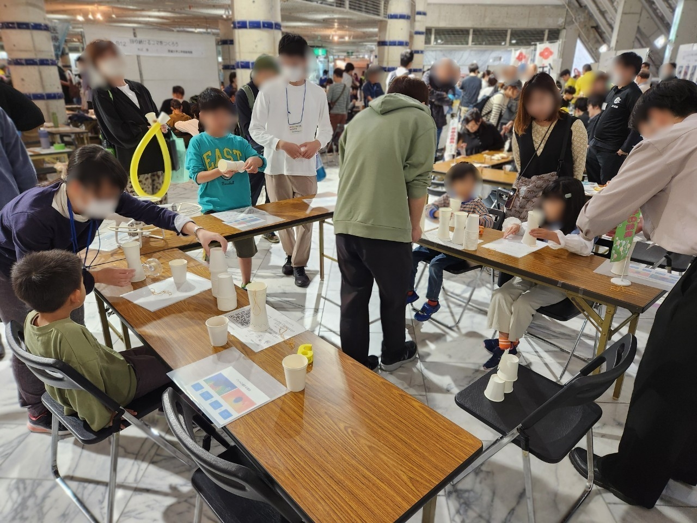

年の瀬も詰まり、今年も残すところあとわずかとなりました。
茨城大学航空技術研究会の活動を支えてくださった皆様に、心より感謝申し上げます。
本年もさまざまな活動を通じて、多くの方々との交流や経験をすることができました。

ここでは、2024年の活動内容をご報告いたします。

## 2024年の活動

1年間を通し、水戸キャンパス第2グラウンドにてドローンの操縦練習を行いました。

日々の練習を通じて操縦技術を磨き、安全性と技術力を向上させることができました。

### 3月

#### 茨城大学熱気球同好会様新歓PV撮影

渡良瀬遊水地にて、茨城大学熱気球同好会様の新歓PV撮影を行いました。

### 4月

#### 新歓祭

茨城大学の新歓祭に参加し、ドローンの操縦体験コーナーを設置しました。

多くの新入生にドローンの魅力を体験していただきました。

### 5月

#### 無人航空機の飛行に関する許可・承認申請

国土交通省に日本全国の全国の無人航空機の飛行に関する許可・承認申請を行いました。

### 6月

#### Japan Drone 2024

Japan Drone 2024 の見学に行きました。

### 8月

#### ドローン体験会

近隣の小学校でドローン体験会を開催し、子どもたちにドローン操作の楽しさを伝えました。

### 10月

#### 科学の祭典

第24回青少年のための科学の祭典・日立大会に参加し、紙コップを用いたマグヌス効果の実験・工作を実施しました。300人以上の子どもたちに科学の魅力を体験していただきました。

### 11月

#### こうがく祭

日立キャンパスのこうがく祭にてドローン操縦体験コーナーを設営しました。

#### 茨苑祭

水戸キャンパスの茨苑祭に参加し、ドローン操縦体験コーナーを設営しました。

[茨苑祭の様子](https://x.com/i/status/1855059739086143609)

#### 世界一行きたい科学広場in浦安2024

世界一行きたい科学広場in浦安2024 に参加しました。

300名を超える方にドローンを体験していただきました。

### 12月

#### 湯楽の里日立店様撮影

湯楽の里日立店様の撮影を行いました。

## 今年のご依頼実績

### 撮影ご依頼

- 茨城大学熱気球同好会様
- 湯楽の里日立店様

### イベント出展

- 茨城大学新歓祭
- こうがく祭
- 茨苑祭
- 世界一行きたい科学広場in浦安2024
- 科学の祭典

## 2025年の展望

2025年も引き続き、ドローン操縦練習を行い、技術力のさらなる向上を目指します。
また、RC飛行機の製作や飛行実験、大会出場といった新たな挑戦にも取り組む予定です。

本年もたくさんのご支援をいただき、誠にありがとうございました。来年も変わらぬご支援とご指導を賜りますよう、お願い申し上げます。
